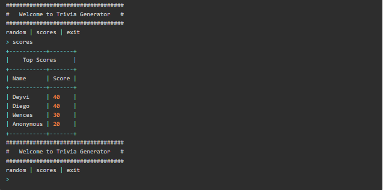

# CLIvia generator

CLIvia is a general culture trivia game where you can answer many questions and see a rank table.




Good luck!

## Before starting!

1. Create a new folder with the project name and open it from VS Code

2. Clone the repository

```
git clone git@github.com:JosHeredia26/Clivia-Ruby.git .
```

3.  Run some initialization scripts

```
bootstrap
```

4.  Install some necessary gems for rubocop to work properly

```
bundle install
```

ready, you can work on your project!

To disable temporarily any Rubocop convention:

```
# rubocop:disable Metrics/AbcSize
def complex_and_irreducible_method(that, receive, a, lot, of, params)
  ...
  ...
  ...
end
# rubocop:enable Metrics/AbcSize
```

To disable them, use the convention that Rubocop is complaining about. _Metrics/AbcSize_ is just an example.
